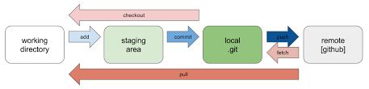

# Guide to Git and Github Setup

This documentation will go through how to set up Git and Github.

 

#### Step 1: Download Git 
The first step is to download Git and Git.bash on your localhost.

[Click here to download Git]( https://git-scm.com/downloads)

#### Step 2: Generate ssh key 
You must generate a ssh key to use for authentication. 

1. Open the terminal 
   
2. Create a .ssh directory `mkdir .ssh` then open the directory `cd .ssh`

3. Now, paste the text below, ensuring to use the email associated with you Github account.

   `$ ssh-keygen -t ed25519 -C "your_email@example.com"`
 

   The Following prompts will appear. For each of these prompts  press enter
   This should generate a public and private key pair 
> Enter a file in which to save the key (/Users/you/.ssh/id_ed25519): [Press enter]

> Enter passphrase (empty for no passphrase): [Type a passphrase]

> Enter same passphrase again: [Type passphrase again]

4. Copy the `.pub` then open Github

5. When on Github, open `Settings` then `SSH and GPG keys` then click `New SSH key` . Now paste 

#### Step 3: Initializing a repo
- `git init` To check what's added to be sent to git hub

- `git status` To ensure only required files are added to be sent

- `git add .` To add git all files or `git add 'name_of_the_file'`

- `git commit -m "message"` To save changes 

- `git branch -M main` **If you have not set remote branch to main**

- `git remote add origin [key]` To Add remote to connect localhost with Github repo

- `git push -u origin main` To push changes to Github 

